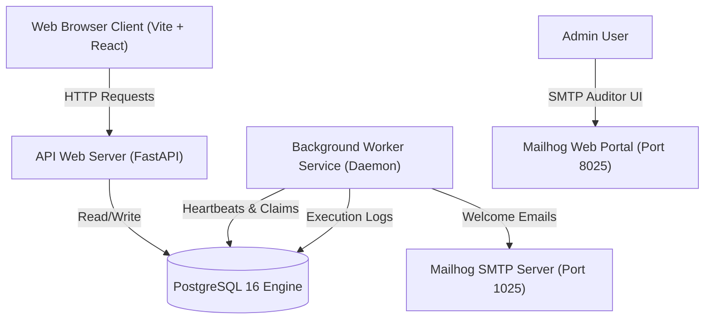
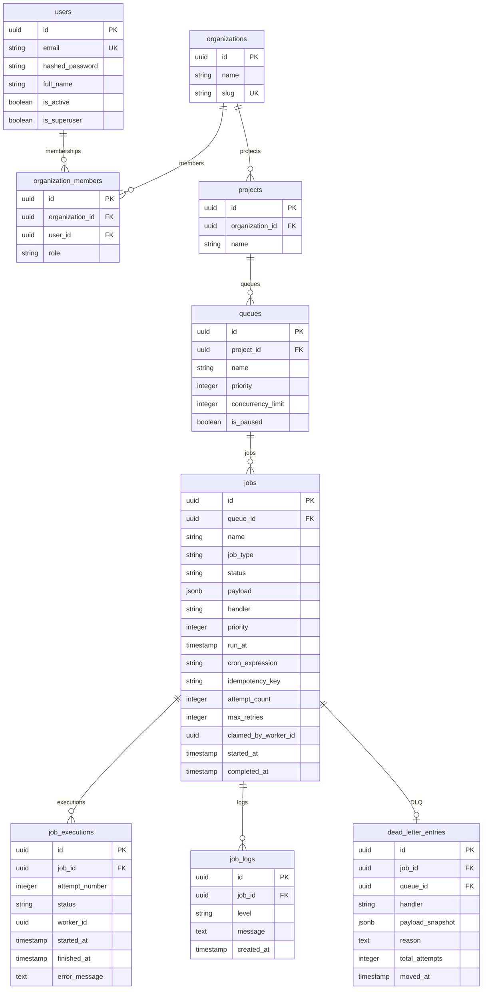

# Distributed Job Scheduler: Architectural Specification

This document details the system architecture, relational database schema, concurrency safety design, and core engineering decisions behind the Distributed Job Scheduler.

---

## 1. System Architecture

The platform uses a decoupled client-server architecture containing five primary containerized components orchestrated via Docker Compose:



### Components:
- **Frontend Dashboard (Port 5173)**: React 19 + TypeScript + Tailwind-inspired glassmorphism styles. Dynamically forks based on roles (System Admin vs. Job Manager).
- **FastAPI Backend (Port 8000)**: Serves REST endpoints for Projects, Queues, Jobs, Workers, and Analytics. Employs async database calls for handling API requests.
- **PostgreSQL 16 Database (Port 5432)**: Relational datastore holding system states, logs, and queue structures.
- **Custom Worker Daemon**: A concurrent polling process running in a separate container context. It claim-locks pending jobs, executes them in threadpools, and handles retry backoffs.
- **Mailhog SMTP Server (Port 8025)**: Captured emails for local signups and notification monitoring.

---

## 2. Entity-Relationship (ER) Database Schema

The database is built on normalized relational structures. On container launch, the tables are automatically generated by the SQLAlchemy database metadata layer.



---

## 3. Concurrency & Claiming Strategy (PostgreSQL Locks)

To achieve reliable execution and guarantee that a single job is **never claimed by multiple workers** (preventing duplicate execution), the worker daemon uses PostgreSQL row-level locks.

Instead of writing complex distributed locks using Redis, we utilize PostgreSQL's native transaction queue claiming query:

```sql
UPDATE jobs
SET status = 'claimed',
    claimed_by_worker_id = %s,
    claimed_at = %s,
    started_at = %s,
    attempt_count = attempt_count + 1,
    lock_token = %s,
    updated_at = %s
WHERE id = (
    SELECT j.id
    FROM jobs j
    JOIN queues q ON j.queue_id = q.id
    WHERE j.status IN ('queued', 'scheduled')
      AND (j.run_at IS NULL OR j.run_at <= %s)
      AND q.is_paused = FALSE
    ORDER BY j.priority ASC, j.created_at ASC
    LIMIT 1
    FOR UPDATE SKIP LOCKED
)
RETURNING *;
```

### Why this is production-grade:
- `FOR UPDATE`: Locks the selected row in a transaction so other transactions block if trying to modify it.
- `SKIP LOCKED`: Instead of waiting/blocking (which causes thread locks and slow queue polling), the database *skips* any locked rows and claims the next available job instantly. This allows perfect horizontal scaling as new worker nodes are spun up.
- **Graceful Shutdown**: The worker daemon captures `SIGINT`/`SIGTERM`. It stops polling, waits for threads in its pool to finish executing, and updates its database state to `offline` before shutting down.

---

## 4. Key Design Decisions & Trade-Offs

1. **Custom DB Claims vs. Celery**: While Celery is standard in Python, it acts as a black box. Building a custom CLAIM daemon shows the candidate understands database transactions, row locks, transaction boundaries, backoff math, and DLQ design.
2. **Synchronous psycopg2 in Worker**: The worker uses synchronous queries inside threads, while the API is asynchronous. This separates concerns: asynchronous API handle thousands of requests without threads, and the worker threads execute compute-heavy jobs reliably with straightforward psycopg2 transactions.
3. **Automatic Table Generation and Seeding**: To make the assignment completely plug-and-play for the reviewer, database table generation and default role seeding (Admins/Managers) happen automatically on container start.
